# 实验作业一：实验平台搭建实验报告

## 1. 实验目标与要求

目标：设计并开发一个可本地部署运行的 Web 应用作为实验平台，满足课程对“用户管理 + 会话管理 + 核心业务 + HTTP/HTTPS”的要求。

要求对照（作业说明）：

- 本地可部署运行（`localhost`）并能通过浏览器访问
- 用户管理：注册、登录/登出、个人信息维护、用户删除/管理、用户操作记录
- 会话管理机制（登录态与超时）
- 核心业务可运行与操作（本项目：图片水印管理）
- 同时支持 HTTP 和 HTTPS 协议
- 源码托管到 GitHub/Gitee 等平台

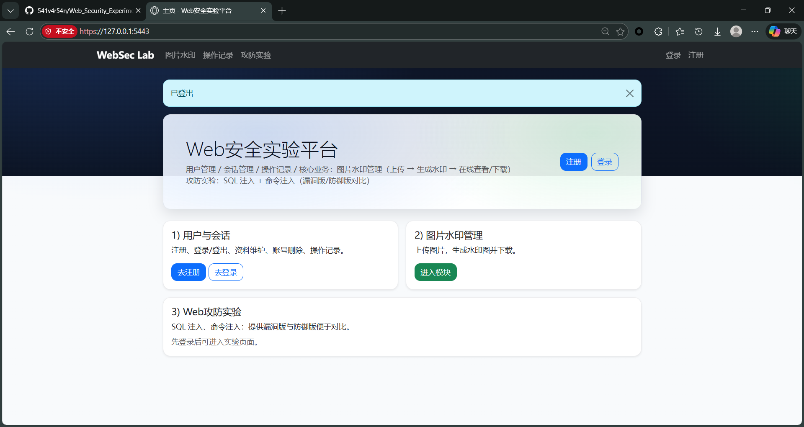

*图1：平台主页（未登录）*

## 2. 平台概述与总体设计

平台名称：WebSec Lab（多用户图片水印管理平台）

总体思路：

- 以“图片水印管理”作为核心业务（上传图片 → 生成水印图 → 在线查看/下载）
- 以“用户管理/会话管理/操作审计”作为通用支撑模块，满足课程实验平台的基础能力
- 所有关键操作写入审计日志，便于后续抓包与安全测试实验进行对比分析

主要页面：

- 主页：`/`
- 注册：`/register`
- 登录/登出：`/login`、`/logout`
- 个人资料：`/profile`
- 操作记录：`/audit`
- 图片水印管理（核心业务）：`/images`、`/images/<id>`
- 用户管理（管理员）：`/users`

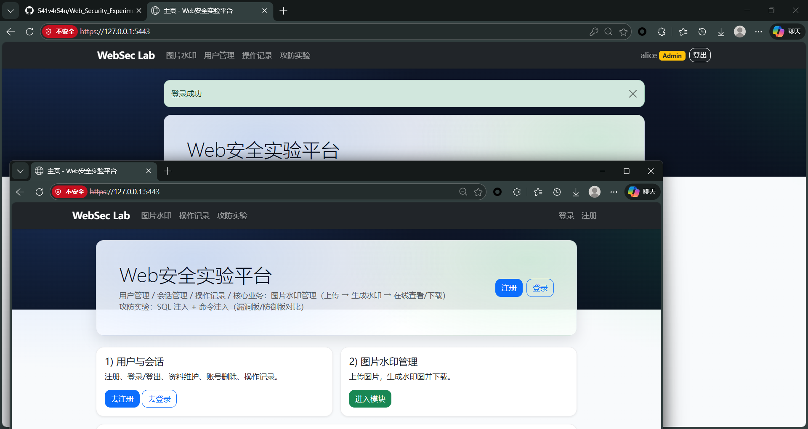

*图2：导航栏（登录前/登录后对比）*

## 3. 技术选型与理由

- Web 前端：Bootstrap 5（本地静态资源）+ 少量原生 JS
  - 理由：开发成本低、界面一致性好，便于快速实现“必要页面”与管理页交互（分页/全选/批量操作等）
- Web 后端：Python + Flask
  - 理由：结构清晰、适合快速搭建教学实验平台；可控地实现认证、会话、CSRF、防御示例等
- Web 服务：
  - HTTP：Waitress（WSGI Server）
  - HTTPS：自签名证书 + HTTPS 监听（实验用途）
- 数据库：SQLite（单机/本地部署成本低，满足实验数据持久化）
- 图片处理：Pillow（对上传图片生成文字水印）

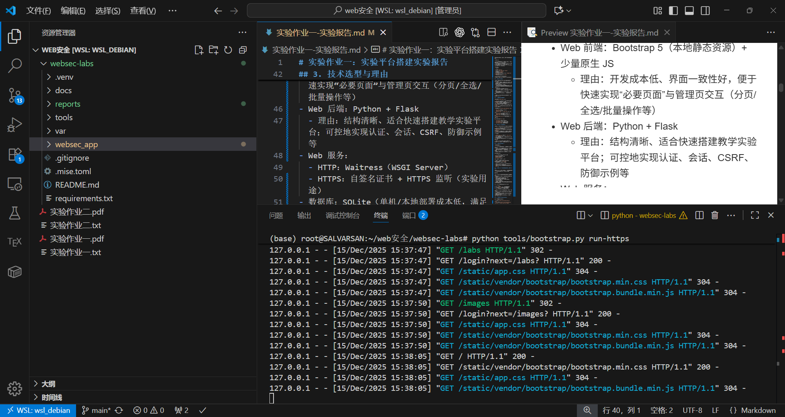

*图3：项目目录结构*

## 4. 系统架构与模块划分

后端模块（`websec_app/`）：

- `auth`：注册、登录/登出、个人资料、账号删除、管理员用户管理、审计日志
- `images`：图片上传、生成水印、预览/下载、删除、搜索、分页、批量操作
- `db`：SQLite 连接与基本查询封装、初始化表结构
- `security`：CSRF、密码哈希、会话超时配置等安全基础能力

前端页面模板（`websec_app/templates/`）：

- `base.html`：统一布局与导航
- `index.html`：主页
- `register.html` / `login.html`：注册与登录
- `profile.html`：个人资料与账号删除
- `audit.html`：操作记录
- `images.html`：图片管理页（核心业务管理）
- `image_detail.html`：图片详情页（原图/水印图）

运行数据目录（`var/`）：

- `var/app.db`：SQLite 数据库
- `var/uploads/`：上传的原始图片
- `var/watermarked/`：生成的水印图
- `var/certs/`：自签名证书与私钥

## 5. 数据库设计（核心表）

本项目使用 SQLite，并在初始化时创建核心表：

- `users`：用户信息（用户名、密码哈希、角色、资料、创建/更新时间）
- `audit_logs`：审计日志（动作、详情、IP、UA、时间）
- `images`：图片记录（归属用户、原文件名、存储文件名、水印文件名、水印文字、时间）

设计要点：

- `images.user_id` 外键关联 `users.id`，实现“多用户数据隔离”
- 删除用户时级联删除其图片记录（并在应用层额外清理磁盘文件）
- 审计日志保留 IP/UA/时间，便于后续安全测试阶段溯源

*图4：DevTools Network：`/api/health` 请求/响应详情（示例）*

*图5：DevTools Network：`/api/images` 请求/响应详情（示例）*

## 6. 用户与会话管理设计

用户管理功能：

- 注册：创建账号（首次注册账号默认为管理员 Admin）
- 登录/登出：登录成功写入会话，登出清理会话
- 个人资料维护：修改显示名与描述
- 账号删除：用户自助删除账号（需二次确认用户名）
- 管理员用户管理：查看用户列表、删除用户

会话管理机制：

- 使用 Flask Cookie Session 保存 `user_id` 作为登录态
- 支持会话超时（通过配置 `SESSION_MINUTES`）

安全基础（实验平台基线）：

- CSRF：所有写操作（POST/PUT/PATCH/DELETE）要求携带 `csrf_token`
- 密码存储：使用哈希而非明文

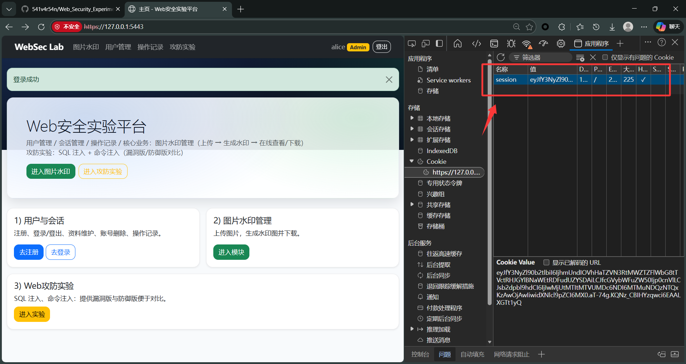

*图6：登录后 Cookie（Session）*

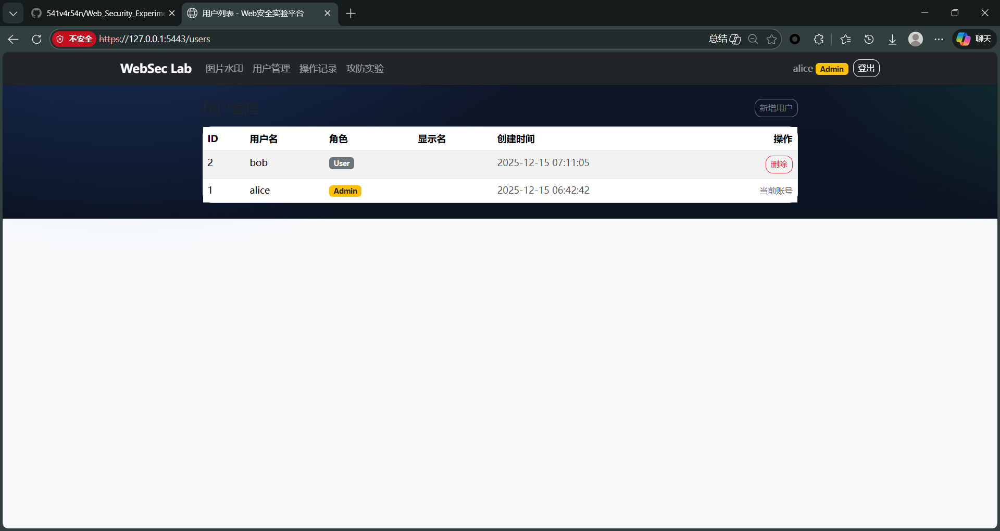

*图7：用户管理页（管理员）*

## 7. 核心业务：图片水印管理（运行与操作说明）

核心业务目标：实现“用户可上传图片并生成水印图”，并提供管理能力用于演示与测试。

功能点：

- 上传：选择图片文件并填写水印文字，生成水印图
- 列表管理：显示预览图、文件名、水印文字、创建时间
- 搜索：按文件名/水印文字模糊检索
- 分页：可切换每页数量并翻页
- 详情：查看水印图与原图（Tab 切换）
- 下载：下载水印图
- 删除：删除单条记录
- 批量操作：批量删除、批量重新生成水印（可选覆盖水印文字）

建议使用流程（写入报告并配截图）：

1) 注册并登录
2) 打开 `/images` 上传图片并生成水印
3) 在管理页进行搜索、分页与批量操作
4) 打开详情页查看原图/水印图并下载

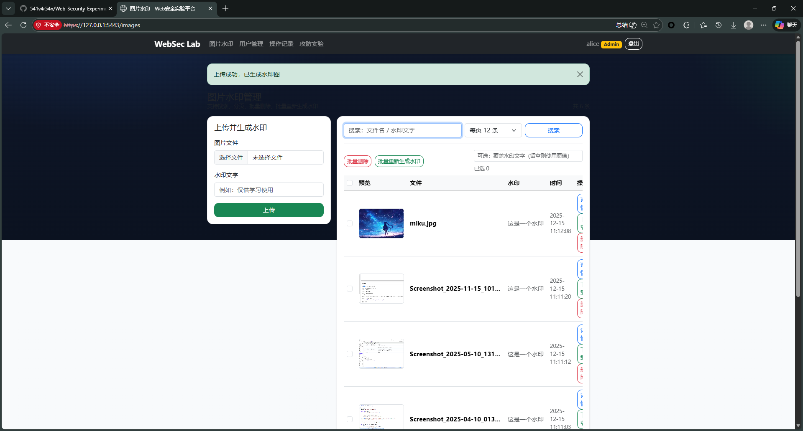

*图8：图片管理页（上传入口 + 列表）*

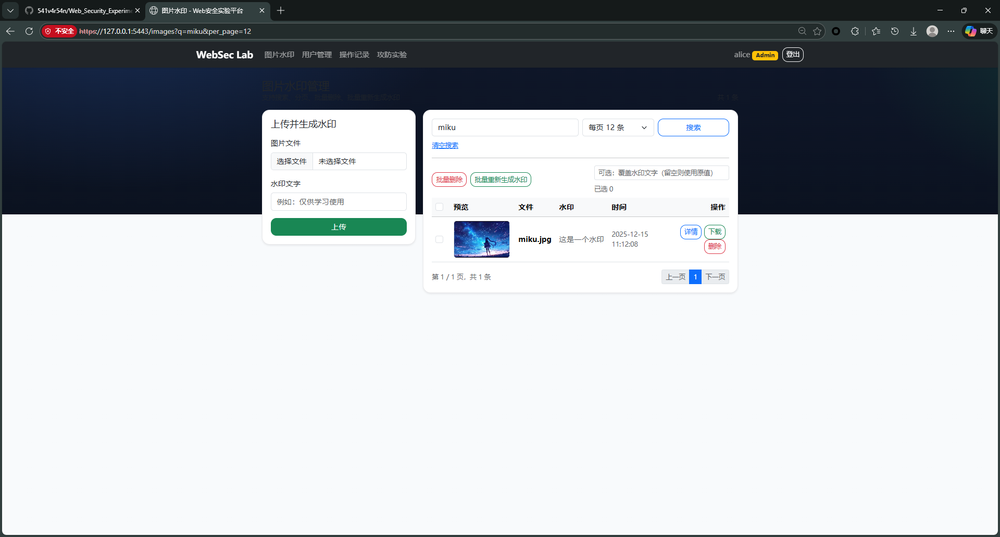

*图9：搜索与分页效果（`q/per_page/page`）*

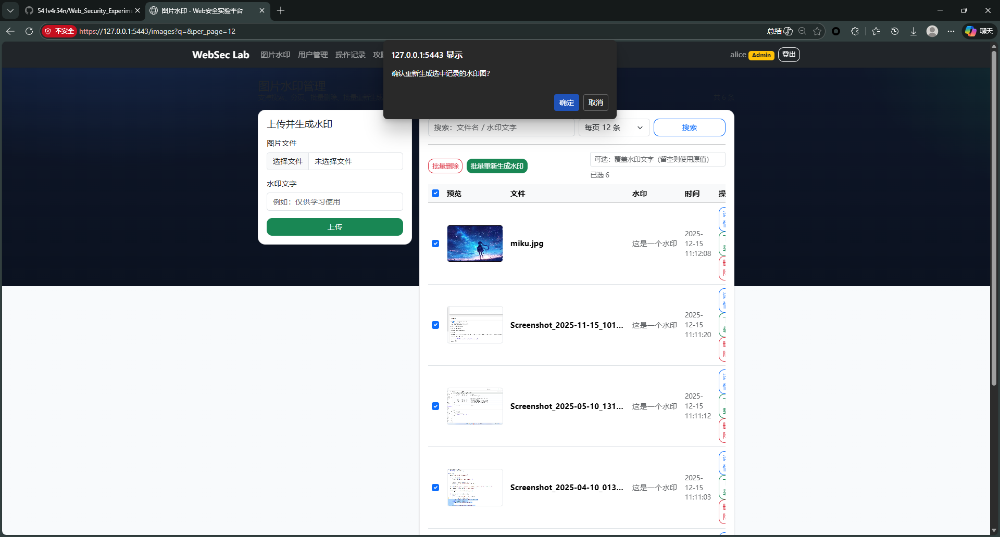

*图10：批量操作（全选/已选数量/批量重新生成水印）*

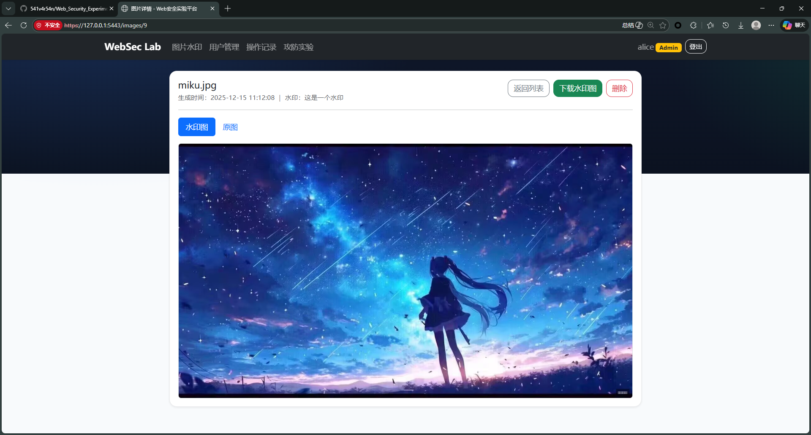

*图11：图片详情页（原图/水印图 Tab + 下载）*

## 8. 部署与运行（HTTP/HTTPS）

方式 A（无需 mise）：

- 初始化：`python tools/bootstrap.py setup`
- 启动 HTTP：`python tools/bootstrap.py run-http` → `http://127.0.0.1:5000`
- 启动 HTTPS：`python tools/bootstrap.py run-https` → `https://127.0.0.1:5443`

方式 B（使用 mise，可选）：

- `mise trust`
- `mise run setup`
- `mise run run-http`
- `mise run run-https`

HTTPS 说明：

- 使用自签名证书，仅用于实验；浏览器提示“不受信任”为正常现象

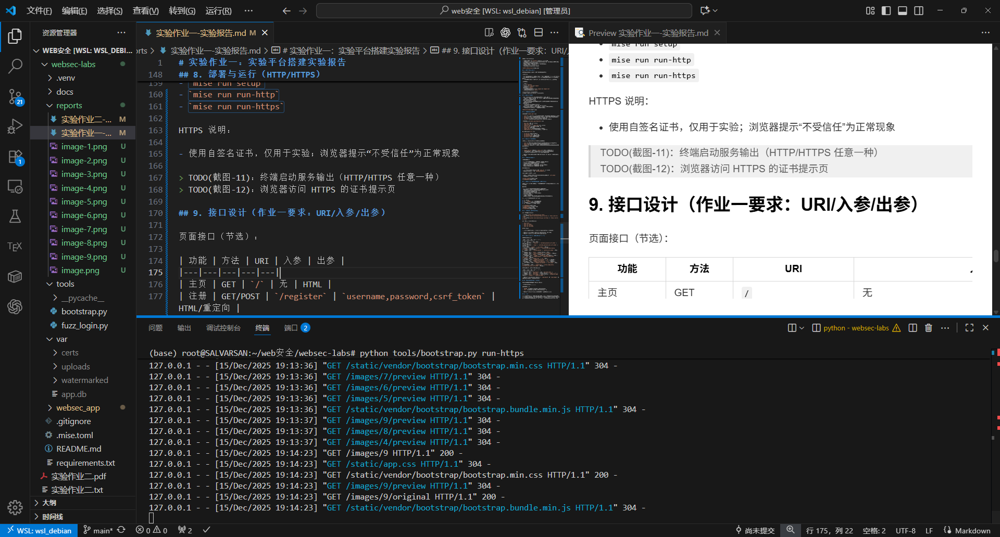

*图12：终端启动服务输出（HTTP/HTTPS）*

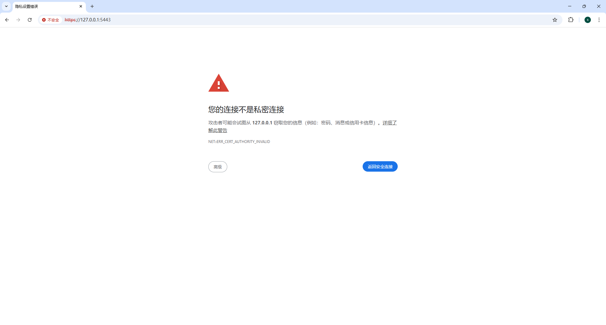

*图13：浏览器访问 HTTPS 的证书提示（自签名证书）*

## 9. 接口设计（作业一要求：URI/入参/出参）

页面接口（节选）：

| 功能 | 方法 | URI | 入参 | 出参 |
|---|---|---|---|---|
| 主页 | GET | `/` | 无 | HTML |
| 注册 | GET/POST | `/register` | `username,password,csrf_token` | HTML/重定向 |
| 登录 | GET/POST | `/login` | `username,password,next,csrf_token` | HTML/重定向 |
| 登出 | POST | `/logout` | `csrf_token` | 重定向 |
| 个人资料 | GET/POST | `/profile` | `display_name,description,csrf_token` | HTML/重定向 |
| 删除账号 | POST | `/account/delete` | `confirm,csrf_token` | 重定向 |
| 用户管理 | GET | `/users` | Cookie Session | HTML |
| 删除用户 | POST | `/users/<id>/delete` | `csrf_token` | 重定向 |
| 操作记录 | GET | `/audit` | Cookie Session | HTML |
| 图片管理页 | GET | `/images` | `q,page,per_page`（可选） | HTML |
| 上传图片 | POST | `/images/upload` | `image,watermark_text,csrf_token` | 重定向 |
| 图片详情 | GET | `/images/<id>` | `id` | HTML |
| 预览水印图 | GET | `/images/<id>/preview` | `id` | 图片内容 |
| 查看原图 | GET | `/images/<id>/original` | `id` | 图片内容 |
| 下载水印图 | GET | `/images/<id>/download` | `id` | 文件下载 |
| 删除图片记录 | POST | `/images/<id>/delete` | `csrf_token` | 重定向 |
| 图片批量操作 | POST | `/images/bulk` | `action,image_ids[],watermark_text,next,csrf_token` | 重定向 |

API（JSON，便于抓包/测试，节选）：

| 功能 | 方法 | URI | 入参 | 出参 |
|---|---|---|---|---|
| 健康检查 | GET | `/api/health` | 无 | `{ok,time,user}` |
| 用户日志 | GET | `/api/audit` | Cookie Session | `{logs:[...]}` |
| 图片列表 | GET | `/api/images` | Cookie Session + `q/page/per_page`（可选） | `{images:[...],page,per_page}` |

*图14：DevTools Network：`/api/health` 请求/响应详情（用于接口抓包说明）*

## 10. 源码托管（GitHub / Gitee）

源码托管地址（填写你的实际仓库链接）：

- GitHub/Gitee：__________

提交要求建议：

- `README` 说明如何初始化与运行（HTTP/HTTPS）
- `var/` 目录不纳入 git（运行数据与证书不上传）

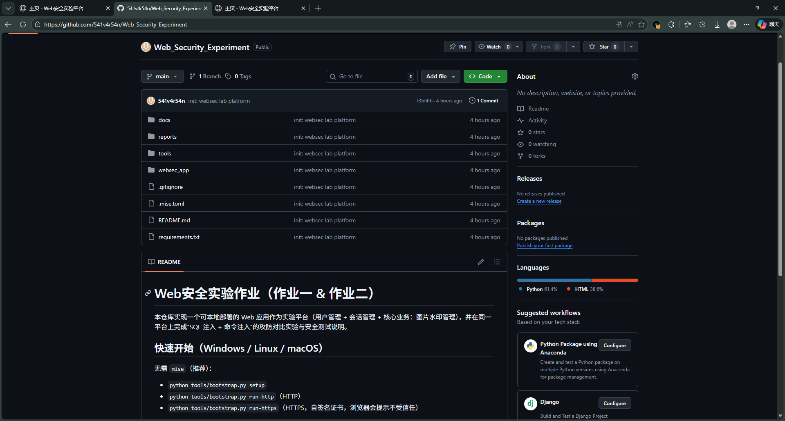

*图15：远程仓库主页（README + 提交记录）*

## 11. 小结

本实验平台满足作业一要求：可本地部署运行，具备用户管理、会话管理、操作审计及可运行的核心业务（图片水印管理），同时支持 HTTP 与 HTTPS 访问，并具备清晰的接口与模块结构，便于后续作业二开展攻防对比与安全测试实验。
